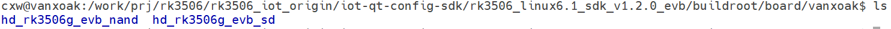
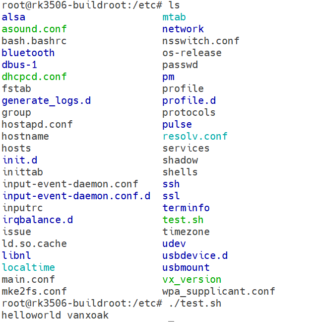

# 应用部署与固件打包

本文介绍如何通过 Buildroot 的 rootfs overlay 机制，将应用程序、脚本和配置文件预置到 HD-RK3506-EVB 的根文件系统中。该方法适用于 NAND 和 SD 卡两种产品配置。

:::tip 适用场景

- 将应用程序预置到 `/usr/bin` 或 `/opt`；
- 将配置文件预置到 `/etc`；
- 将启动脚本预置到 `/etc/init.d`；
- 制作可重复烧录、可批量交付的固件。

:::

## 1. overlay 工作原理

编译 Buildroot 根文件系统时，板级 `fs-overlay` 目录中的文件会按原有目录结构复制到目标根文件系统。例如：

```text
fs-overlay/etc/test.sh  ->  开发板 /etc/test.sh
fs-overlay/usr/bin/demo ->  开发板 /usr/bin/demo
```

HD-RK3506-EVB 的板级目录位于：

```text
buildroot/board/vanxoak/
├── hd_rk3506g_evb_nand/
│   └── fs-overlay/
└── hd_rk3506g_evb_sd/
    └── fs-overlay/
```



## 2. 选择产品配置

请根据目标启动介质选择对应目录，不要混用。

| 启动介质 | Buildroot 配置 | overlay 目录 |
| --- | --- | --- |
| NAND | `rockchip_hd_rk3506g_evb_nand` | `buildroot/board/vanxoak/hd_rk3506g_evb_nand/fs-overlay` |
| SD 卡 | `rockchip_hd_rk3506g_evb_sd` | `buildroot/board/vanxoak/hd_rk3506g_evb_sd/fs-overlay` |

以下操作以 NAND 配置为例；使用 SD 卡配置时，只需将目录中的 `hd_rk3506g_evb_nand` 替换为 `hd_rk3506g_evb_sd`。

## 3. 部署应用和配置文件

### 3.1 部署可执行程序

在 SDK 根目录执行：

```shell
install -Dm755 path/to/demo \
  buildroot/board/vanxoak/hd_rk3506g_evb_nand/fs-overlay/usr/bin/demo
```

其中 `path/to/demo` 为已使用目标工具链编译完成的 ARM 可执行文件。可在编译前确认文件类型：

```shell
file path/to/demo
```

### 3.2 部署脚本

例如，将 `test.sh` 部署到开发板的 `/etc/test.sh`：

```shell
install -Dm755 test.sh \
  buildroot/board/vanxoak/hd_rk3506g_evb_nand/fs-overlay/etc/test.sh
```

示例脚本内容：

```shell
#!/bin/sh
echo "Hello, HD-RK3506-EVB"
```

### 3.3 部署配置文件

普通配置文件通常不需要执行权限，可使用 `0644` 权限：

```shell
install -Dm644 demo.conf \
  buildroot/board/vanxoak/hd_rk3506g_evb_nand/fs-overlay/etc/demo/demo.conf
```

:::warning 文件权限

可执行程序、Shell 脚本和启动脚本必须具有执行权限。若直接复制文件，请在编译前使用 `chmod +x <文件>` 检查并补充执行权限。

:::

## 4. 重新编译并打包固件

在 SDK 根目录执行：

```shell
./build.sh buildroot
./build.sh updateimg
```

第一条命令重新生成 Buildroot 根文件系统，第二条命令将最新镜像重新打包为 `update.img`。如果切换过 NAND/SD 卡配置，请先执行 `./build.sh lunch` 并确认选择了正确的板级配置。

完整编译过程请参阅[完整系统编译](/docs/HD-RK3506-EVB/BuildEnvironment/FullSystemBuild)，固件烧录方法请参阅[固件烧录全流程](/docs/HD-RK3506-EVB/QuickStart/FirmwareFlashing)。

## 5. 烧录后验证

烧录新固件并登录开发板后，根据实际部署内容进行检查：

```shell
ls -l /etc/test.sh
/etc/test.sh

ls -l /usr/bin/demo
/usr/bin/demo
```

若目标文件不存在，请依次检查：

1. `fs-overlay` 是否与当前 NAND/SD 卡配置一致；
2. 文件在 overlay 中的相对路径是否正确；
3. `./build.sh buildroot` 是否成功完成；
4. 是否执行了 `./build.sh updateimg` 并烧录了最新生成的固件。


